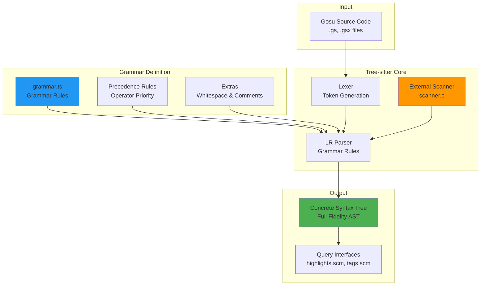
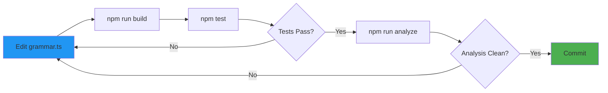

# tree-sitter-gosu

**Tree-sitter grammar for the Gosu programming language**

[](https://github.com/ashan/tree-sitter-gosu)
[](https://nodejs.org/)
[](https://tree-sitter.github.io/)

A production-grade [Tree-sitter](https://tree-sitter.github.io/tree-sitter/) parser for [Gosu](https://gosu-lang.github.io/), the general-purpose JVM programming language created by Guidewire Software.

## 📊 Status

**Validation**: Tested on **5,281 production Gosu files**
- **Success Rate**: 99.98% (5,280/5,281 files)
- **Failure**: 1 known edge case (optional semicolon + complex type cast + foreach)

---

## ✨ Features

### Full Language Support

- ✅ **Declarations**: Classes, Interfaces, Enums, Structures, Enhancements
- ✅ **Generics**: Full type parameter support with bounds
- ✅ **Closures**: Blocks with/without arguments `\-> {...}`
- ✅ **String Interpolation**: `"Hello ${name}"` with nested quotes
- ✅ **Gosu-Specific**: `uses`, `package`, `enhancements`, `properties`
- ✅ **Operators**: Ternary `? :`, Elvis `?:`, Null-safe `?.`, `?[]`
- ✅ **Properties**: Get/set accessors with enhanced syntax
- ✅ **Reification**: Type reflection and parametric polymorphism
- ✅ **Annotations**: Full Java-style annotation support

---

## 🏗️ Architecture

### Parser Structure



### External Scanner (C)

The external scanner (`src/scanner.c`) handles context-sensitive lexing:

```mermaid
flowchart LR
    subgraph "Scanner Responsibilities"
        NUM[Number Literals<br/>0xAF, 1.5bd, 3.14f]
        INTERP[String Interpolation<br/>$${nested} handling]
        CONTEXT[Context Tracking<br/>State management]
    end
    
    INPUT[Character Stream] --> NUM
    INPUT --> INTERP
    INPUT --> CONTEXT
    
    NUM --> TOKEN1[Number Token]
    INTERP --> TOKEN2[String Parts]
    CONTEXT --> TOKEN3[Context Tokens]
    
    TOKEN1 --> PARSER[Parser]
    TOKEN2 --> PARSER
    TOKEN3 --> PARSER
    
    style PARSER fill:#4CAF50
    style INPUT fill:#2196F3
```

### Grammar Organization

```
grammar.ts
├── Declarations
│   ├── class_declaration
│   ├── interface_declaration
│   ├── enum_declaration
│   ├── enhancement_declaration
│   └── structure_declaration
├── Statements
│   ├── for_statement
│   ├── foreach_statement
│   ├── if_statement
│   ├── switch_statement
│   └── try_catch_statement
├── Expressions
│   ├── binary_expression (precedence-based)
│   ├── ternary_expression
│   ├── closure_expression
│   ├── member_expression
│   ├── call_expression
│   └── string_interpolation
└── Types
    ├── type_reference
    ├── generic_type
    ├── array_type
    └── function_type
```

---

## 🚀 Installation

### Prerequisites

- Node.js 18+ (Node 20 or 22 LTS recommended)
- Build tools for native compilation

**macOS:**
```bash
xcode-select --install
```

**Linux (Ubuntu/Debian):**
```bash
sudo apt-get install -y build-essential python3
```

**Windows:**
```bash
# Install Visual Studio Build Tools
# Or via chocolatey
choco install visualstudio2022buildtools
```

### Installing from GitHub

```bash
npm install github:ashan/tree-sitter-gosu
```

### As a Dependency

Add to `package.json`:
```json
{
  "dependencies": {
    "tree-sitter": "^0.25.0",
    "tree-sitter-gosu": "github:ashan/tree-sitter-gosu"
  }
}
```

---

## 💻 Usage

### Node.js API

```javascript
const Parser = require('tree-sitter');
const Gosu = require('tree-sitter-gosu');

const parser = new Parser();
parser.setLanguage(Gosu);

const sourceCode = `
package example

uses java.util.ArrayList

class HelloWorld {
  function sayHello(name: String): String {
    return "Hello ${name}!"
  }
}
`;

const tree = parser.parse(sourceCode);
console.log(tree.rootNode.toString());

// Query for specific nodes
const query = new Parser.Query(
  Gosu,
  '(class_declaration name: (identifier) @class-name)'
);

const matches = query.matches(tree.rootNode);
matches.forEach(match => {
  match.captures.forEach(capture => {
    console.log(`Found class: ${capture.node.text}`);
  });
});
```

### CLI

```bash
# Parse a file
npx tree-sitter parse path/to/file.gs

# Test the grammar
npm test

# Analyze entire codebase
npm run analyze ./gsrc
```

---

## 📁 Project Structure

```
tree-sitter-gosu/
├── grammar.ts              # Grammar definition (TypeScript)
├── src/
│   ├── scanner.c          # External scanner for complex tokens
│   ├── grammar.json       # Generated from grammar.ts
│   └── parser.c           # Generated parser (C)
├── bindings/
│   └── node/              # Node.js bindings
│       ├── binding.cc     # N-API wrapper
│       └── index.js       # JavaScript entry
├── queries/
│   ├── highlights.scm     # Syntax highlighting queries
│   └── tags.scm           # Symbol indexing queries
├── test/
│   └── corpus/            # Corpus tests
├── scripts/
│   ├── analyze_failures.ts # Batch analysis tool
│   └── generate_bulk_corpus.ts
└── prebuilds/             # Platform-specific binaries
```

---

## 🧪 Testing

### Run Corpus Tests

```bash
npm test
```

### Bulk Analysis

Validate against large codebases:

```bash
npm run analyze /path/to/guidewire/gsrc
```

**Output:**
```
✅ Analyzed 5,281 files
✅ Success: 5,280 (99.98%)
❌ Failures: 1 (0.02%)

📊 Report: analysis_report.json
```

The analysis tool generates a detailed JSON report with:
- Success/failure counts and percentages
- List of failed files with error locations
- Parse error types and frequencies
- Performance metrics (files/sec)

---

## 🐛 Known Limitations

### Optional Semicolon + Type Cast + Foreach

There is **one known edge case** (0.02% of tested files):

**Problematic Pattern:**
```gosu
var processor = call() as very.long.qualified.TypeName<GenericArg>
foreach (i in processor.iterator()) {
  // Parser may fail here
}
```

**Root Cause:**  
When a line ends with a complex type cast and **no semicolon**, the parser cannot definitively determine if the statement continues on the next line. It may interpret `foreach` as an identifier rather than a keyword.

**Solutions:**

1. **Add semicolon** (recommended):
   ```gosu
   var processor = call() as TypeName<GenericArg>;
   foreach (i in processor.iterator()) { ... }
   ```

2. **Use `var` in foreach**:
   ```gosu
   var processor = call() as TypeName<GenericArg>
   foreach (var i in processor.iterator()) { ... }
   ```

**Impact:** Affects 1 out of 5,281 files (0.019%)

---

## 🔧 Development

### Building from Source

```bash
# Clone repository
git clone https://github.com/ashan/tree-sitter-gosu.git
cd tree-sitter-gosu

# Install dependencies
npm install

# Generate parser
npm run build

# Run tests
npm test
```

### Grammar Development Workflow



### Grammar Modification Tips

1. **Precedence**: Use `prec.left()`, `prec.right()`, `prec.dynamic()` for operator precedence
2. **Conflicts**: Check for shift/reduce conflicts with `tree-sitter generate --report-states-for-unresolved-conflict`
3. **External Scanner**: Use for context-sensitive lexing (numbers, string interpolation)
4. **Testing**: Add corpus tests for every new feature

---

## 📊 Performance

**Parsing Speed:**
- **Average**: ~500 files/second (on modern hardware)
- **Large files** (>10K LOC): ~100ms per file

**Memory Usage:**
- **Parser instance**: ~5MB
- **AST overhead**: ~2-3x source file size

---

## 🤝 Contributing

Contributions welcome! Here's how:

### Adding Prebuilds

We need prebuilds for **Linux** and **Windows**:

```bash
# Clone and install
git clone https://github.com/ashan/tree-sitter-gosu.git
cd tree-sitter-gosu
npm install

# Generate prebuild
npx prebuildify --napi --strip

# Commit (use -f because prebuilds/ is gitignored)
git add -f prebuilds/
git commit -m "chore: add prebuilds for linux-x64"
git push
```

### Reporting Bugs

Found a parsing error? Please report with:
1. Minimal code sample that fails
2. Expected vs actual parse tree
3. Gosu version/context

---

## 📄 License

MIT License

---

## 🙏 Acknowledgments

- [Tree-sitter](https://tree-sitter.github.io/) team for the incredible parser generator
- [Guidewire Software](https://www.guidewire.com/) for creating the Gosu language
- Contributors and testers from the Guidewire community

---

## 📞 Support

- **Issues**: [GitHub Issues](https://github.com/ashan/tree-sitter-gosu/issues)
- **Discussions**: [GitHub Discussions](https://github.com/ashan/tree-sitter-gosu/discussions)
- **Email**: k.a.a.dilantha@gmail.com

---

**Built with ❤️ for the Guidewire community**
